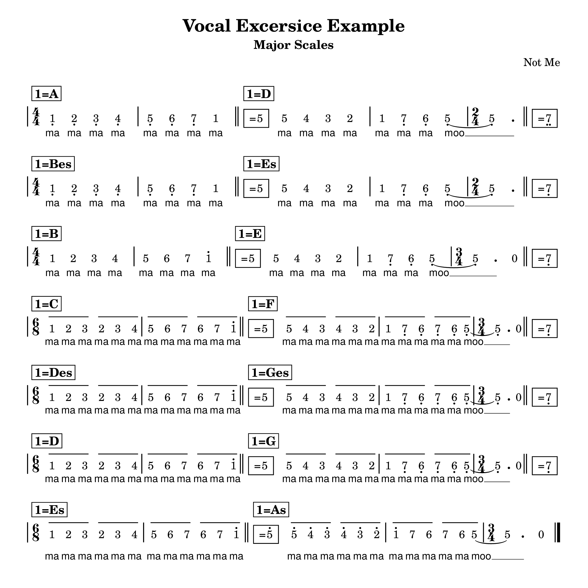
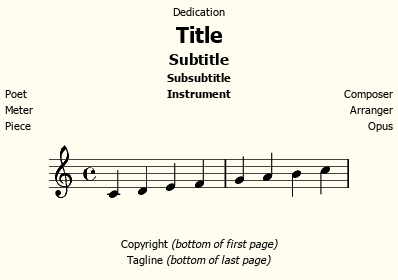
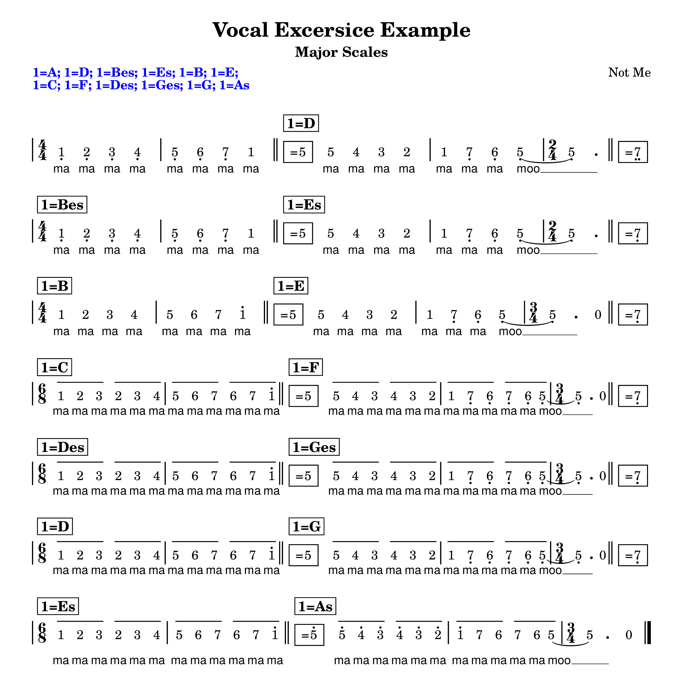
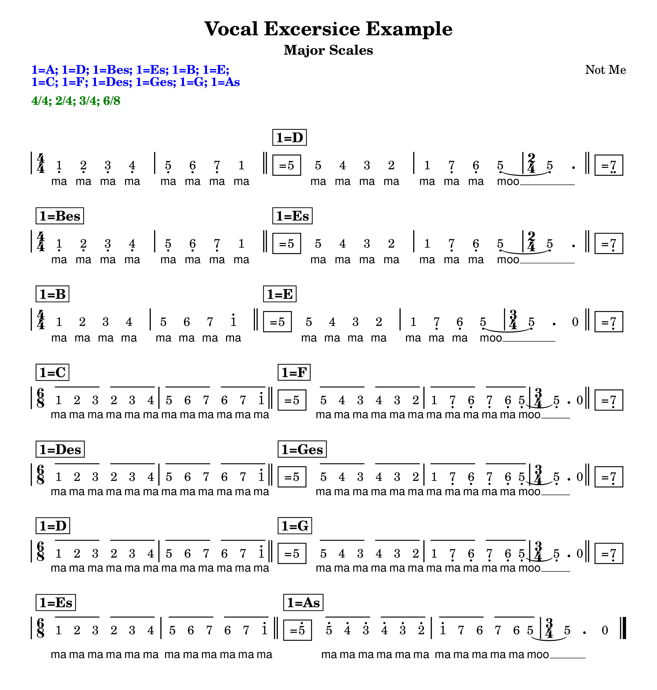

# Printing More Informations in the Header of _Solmisasi_ Score
{: .no_toc .fs-7 }

In common practices, especially in Indonesia, music authors/publishers often print the summary of key signatures and time signatures used throughout the music, in the header section of _Solmisasi_ score/sheet music. So, let's go deeper into this case.
{: .fs-6 }

## Table of Contents
{: .no_toc .text-delta .fs-6 }

1. TOC
{:toc .fs-5}

---

## Printing Key Signature Summary in Header

Let's take this score as our example.
{: .fs-5 }
```
\version "2.20.0"
\include "solmisasi.ily"

\header {
  title = "Vocal Excersice Example"
  subtitle = "Major Scales"
  composer = "Not Me"
  tagline = ##f
}

music = {
  \time 4/4
  \key a \major
  a4 b cis' d' |
  e' fis' gis' a' |
  \bar "||"
  \key d \major
  a' g' fis' e' |
  d' cis' b a~ |
  \time 2/4
  2 |
  \break

  \time 4/4
  \bar "||"
  \key bes \major
  bes4 c' d' es' |
  f' g' a' bes' |
  \bar "||"
  \key es \major
  bes' as' g' f' |
  es' d' c' bes~ |
  \time 2/4
  2 |
  \break

  \time 4/4
  \set Staff.male-vocal = ##t
  \bar "||"
  \key b \major
  b4 cis' dis' e' |
  fis' gis' ais' b' |
  \set Staff.male-vocal = ##f
  \bar "||"
  \key e \major
  b' a' gis' fis' |
  e' dis' cis' b~ |
  \time 3/4
  2 r4 |
  \break

  \time 6/8
  \bar "||"
  \key c \major
  c'8 d' e' d' e' f' |
  g' a' b' a' b' c'' |
  \bar "||"
  \key f \major
  c'' bes' a' bes' a' g' |
  f' e' d' e' d' c'~ |
  \time 3/4
  2 r4 |
  \break

  \time 6/8
  \bar "||"
  \key des \major
  des'8 es' f' es' f' ges' |
  as' bes' c'' bes' c'' des'' |
  \bar "||"
  \key ges \major
  des'' ces'' bes' ces'' bes' as' |
  ges' f' es' f' es' des'~ |
  \time 3/4
  2 r4 |
  \break

  \time 6/8
  \bar "||"
  \key d \major
  d'8 e' fis' e' fis' g' |
  a' b' cis'' b' cis'' d'' |
  \bar "||"
  \key g \major
  d'' c'' b' c'' b' a' |
  g' fis' e' fis' e' d'~ |
  \time 3/4
  2 r4 |
  \break

  \time 6/8
  \bar "||"
  \key es \major
  es'8 f' g' f' g' as' |
  bes' c'' d'' c'' d'' es'' |
  \set Staff.male-vocal = ##t
  \bar "||"
  \key as \major
  es'' des'' c'' des'' c'' bes' |
  as' g' f' g' f' es'~ |
  \time 3/4
  2 r4 |
  \bar "|."

}

lyric = \lyricmode {
  ma ma ma ma ma ma ma ma
  ma ma ma ma ma ma ma moo __
  ma ma ma ma ma ma ma ma
  ma ma ma ma ma ma ma moo __
  ma ma ma ma ma ma ma ma
  ma ma ma ma ma ma ma moo __
  ma ma ma ma ma ma
  ma ma ma ma ma ma
  ma ma ma ma ma ma
  ma ma ma ma ma moo __
  ma ma ma ma ma ma
  ma ma ma ma ma ma
  ma ma ma ma ma ma
  ma ma ma ma ma moo __
  ma ma ma ma ma ma
  ma ma ma ma ma ma
  ma ma ma ma ma ma
  ma ma ma ma ma moo __
  ma ma ma ma ma ma
  ma ma ma ma ma ma
  ma ma ma ma ma ma
  ma ma ma ma ma moo __
}

\score {
  <<
    \new SolmisasiTimeAndKeySignature {
      \solmisasiMusic \silence \music
    }
    \new SolmisasiStaff {
      \new SolmisasiVoice {
        \solmisasiMusic \music
      }
      \addlyrics {
        \solmisasiLyric \lyric
      }
    }
  >>
  \layout {
    \context {
      \Score
      \remove \DbBars
      \override NonMusicalPaperColumn.line-break-permission = ##f
    }
    \context {
      \SolmisasiTimeAndKeySignature
      \omit TimeSignature
    }
    \context {
      \SolmisasiStaff
      \revert TimeSignature.stencil
      \override TimeSignature.font-size = #-1
      \override TimeSignature.break-visibility = #end-of-line-invisible
    }
    \context {
      \Lyrics
      \override LyricText.font-family = #'sans
      \override LyricText.font-size = #-0.5
    }
  }
}
```
{: .lilypond }



Now, we need to define where the key signature summary will be printed in. Please take a look at the following image, which shows us the default layout Lilypond has defined.
{: .fs-5 }
It'd be great if you understand how to modify this default layout, or even make your own layout. But, in this documentation, I will not cover that. Instead, you'd better consult the Lilypond documentation.
{: .fs-4 }


Let's take the `poet` property in the header block to be filled with our key signature summary text.
{: .fs-5 }

For this purpose, we need some additional codes in our snippet, such as:
{: .fs-5 }
- A function to get the value of a header property. We can use `$defaultheader` module which is already defined by Lilypond. To keep our functions modular, I prefer to use parameters than fixed variables. This function would be something like this.
{: .fs-5 }

```
#(define (get-header-property-value sym)
   "Get key signature summary from header props."
   (assoc-ref (ly:module->alist $defaultheader) sym))
```
{: .lilypond }

- A function to set or modify the value of a header property, using `$defaultheader`, too.
{: .fs-5 }

```
#(define (set-header-property-value sym val)
   "Set the value of key signature summary in header props."
   (module-define! $defaultheader sym val))
```
{: .lilypond }

- A void-function to get the list of all key signatures being used in the music, and 'put' them all in a header property. This function occupies a _solmisasi-lily_'s internal music property named `solmisasi-key-sig` to get each of the key signature changes.
{: .fs-5 }

```
updateKeySignatureSummary =
#(define-void-function (music sym) (ly:music? symbol?)
   "Update key signature summary in header."
   (let* ((key-list (list))
          (key-str #f)
          (key-signature-summary (get-header-property-value sym)))
     (music-map
      (lambda (m)
        (if (music-is-of-type? m 'key-change-event)
            (let ((solmisasi-key-sig (ly:music-property m 'solmisasi-key-sig)))
              (set! key-str
                    (if (pair? solmisasi-key-sig)
                        (format "~a=~a"
                          (car solmisasi-key-sig)
                          (get-key-sig-string (cdr solmisasi-key-sig)))
                        #f
                        ))
              (if (and key-str
                       (not (member key-str key-list)))
                  (set! key-list
                        (append key-list (list key-str))))
              ))
        m)
      music)
     (if (positive? (length key-list))
         (if (or (not key-signature-summary)
                 (> (length key-list)
                    (length (string-split (key-signature-summary) #\;))))
             (set-header-property-value sym (string-join key-list "; "))))
     ))
```
{: .lilypond }

- An additional `\header` block after (repeat, it must be after) invoking that `\updateKeySignatureSummary` function. Remember that I already had `poet` property chosen for this purpose. And for the key signature summary, I choose `key-signature-summary` as the name of the dedicated header property. To pass it to the `\updateKeySignatureSummary` function, we need to use its Scheme _symbol_: `#'key-signature-summary`. The coloring in the markup of the `poet` property is applied for display purpose only.
{: .fs-5 }

```
\updateKeySignatureSummary \music #'key-signature-summary

\header {
  poet = \markup \with-color #blue \bold {
    \override #'(baseline-skip . 2.2)
    \override #'(line-width . 40)
    \wordwrap-field #'header:key-signature-summary
  }
}
```
{: .lilypond }

Those functions described above could be inserted anywhere in the original Lilypond snippet. But the execution of `\updateKeySignatureSummary` has to be inserted after the music defined, since we need the `music` variable as the first parameter supplied.
{: .fs-5 }

So, I decided to insert all of those additional codes at the bottom of the original snippet (right after the `\score` definition; this is not the best practice, though!). And here is the complete snippet and the result.
{: .fs-5 }

```
\version "2.20.0"
\include "solmisasi.ily"

\header {
  title = "Vocal Excersice Example"
  subtitle = "Major Scales"
  composer = "Not Me"
  tagline = ##f
}

#(set-default-paper-size "a4")

\paper {
  indent = 0\mm
  system-system-spacing.padding = #4
  ragged-last = ##t
  markup-system-spacing.padding = #4
}

music = \solmisasiMusic {
  \time 4/4
  \once \omit KeySignature
  \key a \major
  a4 b cis' d' |
  e' fis' gis' a' |
  \bar "||"
  \key d \major
  a' g' fis' e' |
  d' cis' b a~ |
  \time 2/4
  2 |
  \break

  \time 4/4
  \bar "||"
  \key bes \major
  bes4 c' d' es' |
  f' g' a' bes' |
  \bar "||"
  \key es \major
  bes' as' g' f' |
  es' d' c' bes~ |
  \time 2/4
  2 |
  \break

  \time 4/4
  \set Staff.male-vocal = ##t
  \bar "||"
  \key b \major
  b4 cis' dis' e' |
  fis' gis' ais' b' |
  \set Staff.male-vocal = ##f
  \bar "||"
  \key e \major
  b' a' gis' fis' |
  e' dis' cis' b~ |
  \time 3/4
  2 r4 |
  \break

  \time 6/8
  \bar "||"
  \key c \major
  c'8 d' e' d' e' f' |
  g' a' b' a' b' c'' |
  \bar "||"
  \key f \major
  c'' bes' a' bes' a' g' |
  f' e' d' e' d' c'~ |
  \time 3/4
  2 r4 |
  \break

  \time 6/8
  \bar "||"
  \key des \major
  des'8 es' f' es' f' ges' |
  as' bes' c'' bes' c'' des'' |
  \bar "||"
  \key ges \major
  des'' ces'' bes' ces'' bes' as' |
  ges' f' es' f' es' des'~ |
  \time 3/4
  2 r4 |
  \break

  \time 6/8
  \bar "||"
  \key d \major
  d'8 e' fis' e' fis' g' |
  a' b' cis'' b' cis'' d'' |
  \bar "||"
  \key g \major
  d'' c'' b' c'' b' a' |
  g' fis' e' fis' e' d'~ |
  \time 3/4
  2 r4 |
  \break

  \time 6/8
  \bar "||"
  \key es \major
  es'8 f' g' f' g' as' |
  bes' c'' d'' c'' d'' es'' |
  \set Staff.male-vocal = ##t
  \bar "||"
  \key as \major
  es'' des'' c'' des'' c'' bes' |
  as' g' f' g' f' es'~ |
  \time 3/4
  2 r4 |
  \bar "|."

}

lyric = \solmisasiLyric \lyricmode {
  ma ma ma ma ma ma ma ma
  ma ma ma ma ma ma ma moo __
  ma ma ma ma ma ma ma ma
  ma ma ma ma ma ma ma moo __
  ma ma ma ma ma ma ma ma
  ma ma ma ma ma ma ma moo __
  ma ma ma ma ma ma
  ma ma ma ma ma ma
  ma ma ma ma ma ma
  ma ma ma ma ma moo __
  ma ma ma ma ma ma
  ma ma ma ma ma ma
  ma ma ma ma ma ma
  ma ma ma ma ma moo __
  ma ma ma ma ma ma
  ma ma ma ma ma ma
  ma ma ma ma ma ma
  ma ma ma ma ma moo __
  ma ma ma ma ma ma
  ma ma ma ma ma ma
  ma ma ma ma ma ma
  ma ma ma ma ma moo __
}

\score {
  <<
    \new SolmisasiTimeAndKeySignature {
      \music
    }
    \new SolmisasiStaff {
      \new SolmisasiVoice {
        \music
      }
      \addlyrics {
        \lyric
      }
    }
  >>
  \layout {
    \context {
      \Score
      \remove \DbBars
      \override NonMusicalPaperColumn.line-break-permission = ##f
    }
    \context {
      \SolmisasiTimeAndKeySignature
      \omit TimeSignature
    }
    \context {
      \SolmisasiStaff
      \revert TimeSignature.stencil
      \override TimeSignature.font-size = #-1
      \override TimeSignature.break-visibility = #end-of-line-invisible
    }
    \context {
      \Lyrics
      \override LyricText.font-family = #'sans
      \override LyricText.font-size = #-0.5
    }
  }
}

#(define (get-header-property-value sym)
   "Get key signature summary from header props."
   (assoc-ref (ly:module->alist $defaultheader) sym))

#(define (set-header-property-value sym val)
   "Set the value of key signature summary in header props."
   (module-define! $defaultheader sym val))

updateKeySignatureSummary =
#(define-void-function (music sym) (ly:music? symbol?)
   "Update key signature summary in header."
   (let* ((key-list (list))
          (key-str #f)
          (key-signature-summary (get-header-property-value sym)))
     (music-map
      (lambda (m)
        (if (music-is-of-type? m 'key-change-event)
            (let ((solmisasi-key-sig (ly:music-property m 'solmisasi-key-sig)))
              (set! key-str
                    (if (pair? solmisasi-key-sig)
                        (format "~a=~a"
                          (car solmisasi-key-sig)
                          (get-key-sig-string (cdr solmisasi-key-sig)))
                        #f
                        ))
              (if (and key-str
                       (not (member key-str key-list)))
                  (set! key-list
                        (append key-list (list key-str))))
              ))
        m)
      music)
     (if (positive? (length key-list))
         (if (or (not key-signature-summary)
                 (> (length key-list)
                    (length (string-split (key-signature-summary) #\;))))
             (set-header-property-value sym (string-join key-list "; "))))
     ))

\updateKeySignatureSummary \music #'key-signature-summary

\header {
  poet = \markup \with-color #blue \bold {
    \override #'(baseline-skip . 2.2)
    \override #'(line-width . 40)
    \wordwrap-field #'header:key-signature-summary
  }
}
```
{: .lilypond }



---

## Printing Time Signature Summary in Header

Similarly, we can write a function to get the list of all time signatures being used in the music, and 'put' them all in a header property. We already have `get-header-property-value` and `set-header-property-value` functions. So, the only thing we need to do now is modifying the `updateKeySignatureSummary` to `updateTimeSignatureSummary` function, by utilizing another `solmisasi-lily`'s internal music property named `solmisasi-time-sig`.
{: .fs-5 }

Both of these functions are identical, so you may write a single function to do both purposes. But, let's just separate them for now. Here is the code.
{: .fs-5 }

```
updateTimeSignatureSummary =
#(define-void-function (music sym) (ly:music? symbol?)
   "Update time signature summary in header."
   (let* ((time-list (list))
          (time-str #f)
          (time-signature-summary (get-header-property-value sym)))
     (music-map
      (lambda (m)
        (if (music-is-of-type? m 'time-signature-music)
            (let ((solmisasi-time-sig (ly:music-property m 'solmisasi-time-sig)))
              (set! time-str
                    (if (pair? solmisasi-time-sig)
                        (format "~a/~a"
                          (car solmisasi-time-sig)
                          (cdr solmisasi-time-sig))
                        #f
                        ))
              (if (and time-str
                       (not (member time-str time-list)))
                  (set! time-list
                        (append time-list (list time-str))))
              ))
        m)
      music)
     (if (positive? (length time-list))
         (if (or (not time-signature-summary)
                 (> (length time-list)
                    (length (string-split (time-signature-summary) #\;))))
             (set-header-property-value sym (string-join time-list "; "))))
     ))
```
{: .lilypond }

Don't forget to append the header property definition with this time signature summary. In this case, I choose `meter` as the property where the time signature summary will be printed.
{: .fs-5 }

```
\updateTimeSignatureSummary \music #'time-signature-summary

\header {
  meter = \markup {
    \vspace #1
    \with-color #darkgreen \bold {
      \override #'(baseline-skip . 2.2)
      \override #'(line-width . 40)
      \wordwrap-field #'header:time-signature-summary
    }
  }
}
```
{: .lilypond }

And, here is the complete snippet and the compiled result.
{: .fs-5 }

```
\version "2.20.0"
\include "solmisasi.ily"

\header {
  title = "Vocal Excersice Example"
  subtitle = "Major Scales"
  composer = "Not Me"
  tagline = ##f
}

#(set-default-paper-size "a4")

\paper {
  indent = 0\mm
  system-system-spacing.padding = #4
  ragged-last = ##t
  markup-system-spacing.padding = #4
}

music = \solmisasiMusic {
  \time 4/4
  \once \omit KeySignature
  \key a \major
  a4 b cis' d' |
  e' fis' gis' a' |
  \bar "||"
  \key d \major
  a' g' fis' e' |
  d' cis' b a~ |
  \time 2/4
  2 |
  \break

  \time 4/4
  \bar "||"
  \key bes \major
  bes4 c' d' es' |
  f' g' a' bes' |
  \bar "||"
  \key es \major
  bes' as' g' f' |
  es' d' c' bes~ |
  \time 2/4
  2 |
  \break

  \time 4/4
  \set Staff.male-vocal = ##t
  \bar "||"
  \key b \major
  b4 cis' dis' e' |
  fis' gis' ais' b' |
  \set Staff.male-vocal = ##f
  \bar "||"
  \key e \major
  b' a' gis' fis' |
  e' dis' cis' b~ |
  \time 3/4
  2 r4 |
  \break

  \time 6/8
  \bar "||"
  \key c \major
  c'8 d' e' d' e' f' |
  g' a' b' a' b' c'' |
  \bar "||"
  \key f \major
  c'' bes' a' bes' a' g' |
  f' e' d' e' d' c'~ |
  \time 3/4
  2 r4 |
  \break

  \time 6/8
  \bar "||"
  \key des \major
  des'8 es' f' es' f' ges' |
  as' bes' c'' bes' c'' des'' |
  \bar "||"
  \key ges \major
  des'' ces'' bes' ces'' bes' as' |
  ges' f' es' f' es' des'~ |
  \time 3/4
  2 r4 |
  \break

  \time 6/8
  \bar "||"
  \key d \major
  d'8 e' fis' e' fis' g' |
  a' b' cis'' b' cis'' d'' |
  \bar "||"
  \key g \major
  d'' c'' b' c'' b' a' |
  g' fis' e' fis' e' d'~ |
  \time 3/4
  2 r4 |
  \break

  \time 6/8
  \bar "||"
  \key es \major
  es'8 f' g' f' g' as' |
  bes' c'' d'' c'' d'' es'' |
  \set Staff.male-vocal = ##t
  \bar "||"
  \key as \major
  es'' des'' c'' des'' c'' bes' |
  as' g' f' g' f' es'~ |
  \time 3/4
  2 r4 |
  \bar "|."

}

lyric = \solmisasiLyric \lyricmode {
  ma ma ma ma ma ma ma ma
  ma ma ma ma ma ma ma moo __
  ma ma ma ma ma ma ma ma
  ma ma ma ma ma ma ma moo __
  ma ma ma ma ma ma ma ma
  ma ma ma ma ma ma ma moo __
  ma ma ma ma ma ma
  ma ma ma ma ma ma
  ma ma ma ma ma ma
  ma ma ma ma ma moo __
  ma ma ma ma ma ma
  ma ma ma ma ma ma
  ma ma ma ma ma ma
  ma ma ma ma ma moo __
  ma ma ma ma ma ma
  ma ma ma ma ma ma
  ma ma ma ma ma ma
  ma ma ma ma ma moo __
  ma ma ma ma ma ma
  ma ma ma ma ma ma
  ma ma ma ma ma ma
  ma ma ma ma ma moo __
}

\score {
  <<
    \new SolmisasiTimeAndKeySignature {
      \music
    }
    \new SolmisasiStaff {
      \new SolmisasiVoice {
        \music
      }
      \addlyrics {
        \lyric
      }
    }
  >>
  \layout {
    \context {
      \Score
      \remove \DbBars
      \override NonMusicalPaperColumn.line-break-permission = ##f
    }
    \context {
      \SolmisasiTimeAndKeySignature
      \omit TimeSignature
    }
    \context {
      \SolmisasiStaff
      \revert TimeSignature.stencil
      \override TimeSignature.font-size = #-1
      \override TimeSignature.break-visibility = #end-of-line-invisible
    }
    \context {
      \Lyrics
      \override LyricText.font-family = #'sans
      \override LyricText.font-size = #-0.5
    }
  }
}

#(define (get-header-property-value sym)
   "Get key signature summary from header props."
   (assoc-ref (ly:module->alist $defaultheader) sym))

#(define (set-header-property-value sym val)
   "Set the value of key signature summary in header props."
   (module-define! $defaultheader sym val))

updateKeySignatureSummary =
#(define-void-function (music sym) (ly:music? symbol?)
   "Update key signature summary in header."
   (let* ((key-list (list))
          (key-str #f)
          (key-signature-summary (get-header-property-value sym)))
     (music-map
      (lambda (m)
        (if (music-is-of-type? m 'key-change-event)
            (let ((solmisasi-key-sig (ly:music-property m 'solmisasi-key-sig)))
              (set! key-str
                    (if (pair? solmisasi-key-sig)
                        (format "~a=~a"
                          (car solmisasi-key-sig)
                          (get-key-sig-string (cdr solmisasi-key-sig)))
                        #f
                        ))
              (if (and key-str
                       (not (member key-str key-list)))
                  (set! key-list
                        (append key-list (list key-str))))
              ))
        m)
      music)
     (if (positive? (length key-list))
         (if (or (not key-signature-summary)
                 (> (length key-list)
                    (length (string-split (key-signature-summary) #\;))))
             (set-header-property-value sym (string-join key-list "; "))))
     ))

\updateKeySignatureSummary \music #'key-signature-summary

\header {
  poet = \markup \with-color #blue \bold {
    \override #'(baseline-skip . 2.2)
    \override #'(line-width . 40)
    \wordwrap-field #'header:key-signature-summary
  }
}

updateTimeSignatureSummary =
#(define-void-function (music sym) (ly:music? symbol?)
   "Update time signature summary in header."
   (let* ((time-list (list))
          (time-str #f)
          (time-signature-summary (get-header-property-value sym)))
     (music-map
      (lambda (m)
        (if (music-is-of-type? m 'time-signature-music)
            (let ((solmisasi-time-sig (ly:music-property m 'solmisasi-time-sig)))
              (set! time-str
                    (if (pair? solmisasi-time-sig)
                        (format "~a/~a"
                          (car solmisasi-time-sig)
                          (cdr solmisasi-time-sig))
                        #f
                        ))
              (if (and time-str
                       (not (member time-str time-list)))
                  (set! time-list
                        (append time-list (list time-str))))
              ))
        m)
      music)
     (if (positive? (length time-list))
         (if (or (not time-signature-summary)
                 (> (length time-list)
                    (length (string-split (time-signature-summary) #\;))))
             (set-header-property-value sym (string-join time-list "; "))))
     ))

\updateTimeSignatureSummary \music #'time-signature-summary

\header {
  meter = \markup {
    \vspace #1
    \with-color #darkgreen \bold {
      \override #'(baseline-skip . 2.2)
      \override #'(line-width . 40)
      \wordwrap-field #'header:time-signature-summary
    }
  }
}
```
{: .lilypond }


