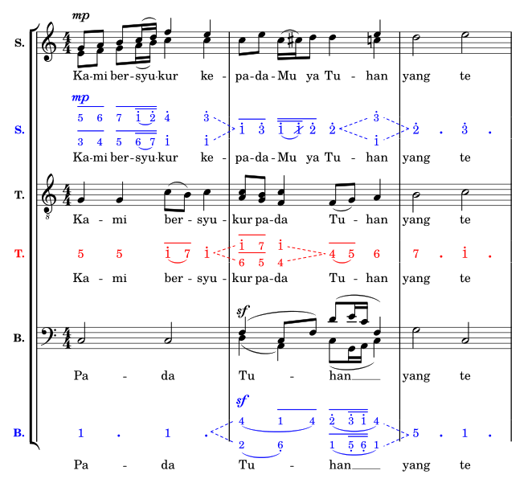
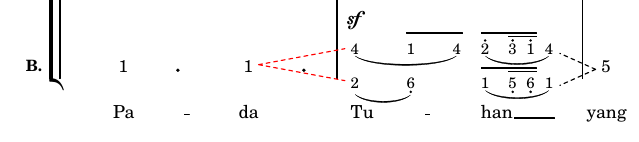

# {{ page.title }}
{: .no_toc .fs-6 }

Bundled in **solmisasi-lily-v1.0.6-beta** and up
{: .label .label-green }

<div class="code-example" markdown="1">

Full path (Linux/Mac): `<solmisasi-lily-root-dir>/lib/extension/solmisasi-{{ page.ext_name }}.ily`

Full path (Windows): `<solmisasi-lily-root-dir>\lib\extension\solmisasi-{{ page.ext_name }}.ily`

Description:
> This extension contains some necessary helper functions to accommodate simultaneous _divisi_ within a single staff music. With this extension loaded, new music tag `'solmisasi` is introduced. This music tag is used to distinguish between _solmisasi-notation_-specific music and the original standard notation music.

Layout objects:
> - _Open Divisi_ spanner: a spanner grob which indicates a change in the music from one-voice music to simultaneous music (limited to two voices).
> - _Close Divisi_ spanner: a spanner grob which indicates a change in the music from simultaneous music (limited to two voices) to one-voice music.
> Notes:
> - Originally, those spanners are **text spanners**. Some needed text spanners settings are incorporated and used in their internal calculation routine, such as the `'bound-details` settings (`left.padding` and `right.padding`).
> - I decided to use dashed-line style in drawing those spanners in order to make it visually different from the Hairpin object.

Main command(s):
> - `\voiceOne`
> > Overridden from the original `\voiceOne` with some additional commands to adjust the position and size of the higher pitched music in a specific simultaneous music passage. The formatted _solmisasi_ music is tagged by `'solmisasi` tag, and the original music is kept intact. To engrave the original music using standard notation, you have to exlude the _solmisasi_-tagged music part with `\removeWithTag #'solmisasi.` This voice context should be explicitly declared with **the same context ID** as the surrounding music. Use `Voice` context type here, rather than `SolmisasiVoice`, so it will also be engraved correctly in original standard notation. Please see the attached example.
> - `\voiceTwo`
> > Overridden from the original `\voiceTwo` with some additional commands to adjust the position and size of the lower pitched music in a specific simultaneous music passage. The formatted _solmisasi_ music is tagged by `'solmisasi` tag, and the original music is kept intact. To engrave the original music using standard notation, you have to exlude the _solmisasi_-tagged music part with `\removeWithTag #'solmisasi`. No need to explicitly declare this context ID. Please see the attached example.
> - `\oneVoice`
> > Overridden from the original `\oneVoice` with some additional commands to revert the position and size of all music objects when the music goes to single/one voice passage. No need to explicitly use this command as it is incorporated in the `\stopDivisiSpan` (see below), unless there is a special need to call this.
> - `\startOpenDivisiSpan`
> > This command is used to start an _open divisi_ spanner, and can be called at the last note of the one-voice passage, just before the music goes simultaneous. Please see the attached example.
> - `\startCloseDivisiSpan`
> > This command is used to start a _close divisi_ spanner, and can be called at the last note of the first (higher pitched) context in simultaneous divisi music, just before the music goes sequential (one-voice). Please see the attached example.
> - `\stopDivisiSpan`
> > This command is used to stop any divisi spanners, and can be called just before the first note of the following simultaneous or sequential music. The modified `\oneVoice` is incorporated in this command.

Scenario:
```
music = {
  [one-voice music passage]\startOpenDivisiSpan
  <<
    \context Voice = [name] {
      \stopDivisiSpan
      \voiceOne
      [voice-one music passage]\startCloseDivisiSpan
    }
    \\
    {
      \voiceTwo
      [voice-two music passage]
    }
  >>
  \stopDivisiSpan
  [another one-voice music passage]
  ...
}
```
{: .lilypond }
Notes:
- Using a simultaneous music separator (`\\`) is **mandatory**.
- Since `\oneVoice` is called inside the `\stopDivisiSpan`, `\voiceOne` must be written after `\stopDivisiSpan`.

---

Example of Usage:
```
\withExtensions #'(
  "{{ page.ext_name }}"
)

%% The Soprano part from the attached image
sop = {
  \relative c'' {
    <<
      \context Voice = "sop" {
        \voiceOne sol8^\mp la si do16( re) fa4 mi\startCloseDivisiSpan
      }
      \\
      {
        \voiceTwo mi,8 fa sol la16( si) do4 do
      }
    >>
    \stopDivisiSpan
    do8 mi8 do16( di16) re8 re4\startOpenDivisiSpan
    <<
      \context Voice = "sop"
      {
        \stopDivisiSpan
        \voiceOne mi\startCloseDivisiSpan
      }
      \\
      {
        \voiceTwo do
      }
    >> |
    \stopDivisiSpan
    re2 mi2 |
  }
}

lsop = \lyricmode {
  Ka -- mi ber -- syu -- kur ke --
  pa -- da -- Mu ya Tu -- han yang te
}

<<
  \new Staff \with { instrumentName = \markup\bold "S." } {
    \new Voice = "sop" \removeWithTag #'solmisasi \sop
  }
  \new Lyrics \with { \override LyricText.font-size = #0.5 }
  \lyricsto "sop" \lsop

  \new SolmisasiStaff \with { instrumentName = \markup\bold "S." } {
    \new SolmisasiVoice = "sop" \solmisasiMusic \sop
  }
  \new SolmisasiLyrics \with {
    \override LyricText.font-size = #0.5
  } \lyricsto "sop" { \solmisasiLyrics \lsop }
>>
```
{: .lilypond }

Example of the Engraved Score:



**Possible Problems**
<div class="code-example" markdown="1">
```
bas = {
  \clef bass
  \relative c {
    do2 do2\startOpenDivisiSpan
    <<
      \context Voice = "bas"
      {
        \stopDivisiSpan
        \voiceOne
        fa4(\sf do8 fa8) re'8( mi16 do16 fa,4)\startCloseDivisiSpan
      }
      \\
      {
        \voiceTwo re4( la) do8( sol16 la16 do4)
      }
    >>
    \stopDivisiSpan
    sol'2 do,2 |
  }
}
```
{: .lilypond }



</div>

The red-colored _open divisi_ spanner is incorrect in its starting coordinate. It should be drawn right after the last duration dot in the first bar. To overcome this problem, you can use some tweaks or workarounds, such as:
- tweak the left bound padding of the _open divisi_ spanner:<br>
  ```
  do2 do2-\tweak bound-details.left.padding #7 \startOpenDivisiSpan
  ```
  which resulted in the first example image, or
- wrap the second "do2" in a simultaneous music (using skips in the second element):<br>
  ```
  do2 << { do2 } { s4 s4\startOpenDivisiSpan } >>
  ```

</div>
