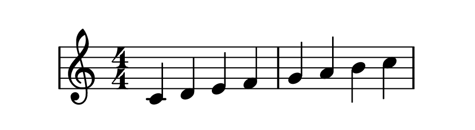

# Getting Started with _solmisasi-lily_
{: .no_toc .fs-9 }

Before we start this section, please keep in mind that _solmisasi-lily_ is just an 'extension' or library to Lilypond. So, everything that _solmisasi-lily_ deals with is fully based on the core Lilypond. However, this documentation doesn't cover the details of the core Lilypond, so deep knowledge of using Lilypond in engraving scores/sheet music IS A MUST.
{: .fs-6 }

## Table of Contents
{: .no_toc .text-delta .fs-6 }

1. TOC
{:toc .fs-5 }

---

## Obtaining _solmisasi-lily_ Library

This library could be obtained by downloading this archive: <a href="{{ site.archive_url }}">{{ site.archive_url_title }}</a> , or by cloning the repo to your machine. If you choose to download the archive, please extract it to your project folder. Let's say, the project folder where this library extracted is `X:\solmisasi-lily` (so the _solmisasi-lily_ library exists in `X:\solmisasi-lily\lib`).
{: .fs-5 }
Notes:<br>
Please keep in mind that Lilypond is a cross-platform software. Therefore, the usage of this library is not OS-specific. ~~However, I will use MS Windows approach, even though I also extensively run Lilypond with this library in my Linux station as well.~~ Should you face any problems in running Lilypond on your machine's OS, please consult the [Lilypond manuals](http://lilypond.org/manuals.html).

---

## Creating and Compiling Our First _Solmisasi_ Score

Let's write a new simple Lilypond snippet like this:
{: .fs-5 }

```
\version "2.20.0"

music = {
  \key c \major
  \relative c' {
    c4 d e f g a b c
  }
}

\new Staff {
  \new Voice {
    \music
  }
}
```
{: .lilypond }

Save it to `getting-started-example-01.ly`, and compile it using simple Lilypond compilation command. The result is:<br>
{: .fs-5 }


To 'convert' that standard notation to _solmisasi_, we need:
{: .fs-5 }
1. this _solmisasi-lily_ library, to be included at the top of the snippet,
2. a _music function_, named [\solmisasiMusic](../appendices/custom-functions.html#solmisasiMusic),
3. a custom Staff context, named [SolmisasiStaff](../appendices/custom-contexts.html#solmisasistaff), and
4. a custom Voice context, named [SolmisasiVoice](../appendices/custom-contexts.html#solmisasivoice).
{: .fs-5 }

So, let's modify the snippet with this one:
{: .fs-5 }

```
\version "2.20.0"
\include "solmisasi.ily"

music = {
  \key c \major
  \relative c' {
    c4 d e f g a b c
  }
}

\new SolmisasiStaff {
  \new SolmisasiVoice {
    \solmisasiMusic \music
  }
}
```
{: .lilypond }

From now on, we can't use the same simple Lilypond compilation command, if the directory/folder of this Lilypond snippet file is different with the one where _solmisasi-lily_ is located. Use this pattern in command prompt / shell:
{: .fs-5 }
```console
<path-to-lilypond> --include="<path-to-solmisasi-lily-lib>" <snippet-filename>
```
Assuming that you already have Lilypond in your searchable path environment variable, the command would be:
{: .fs-5 }
```console
lilypond --include="X:\solmisasi-lily\lib" getting-started-example-01.ly
```

And the result is:<br>
{: .fs-5 }


**TIPS**
{: .label .label-green }
> Using a helper software like [Frescobaldi](https://frescobaldi.org/) to develop our Lilypond scores is highly recommended. In this software, there are some configuration options for defining Lilypond search path, both as a global option, and as a particular session option. With these options defined, the hassle of invoking Lilypond compilation command could be avoided.
{: .fs-4 }

## Time and Key Signatures in _Solmisasi_ System

Let's continue...<br>
You could clearly see that there were some standard notation objects missing in the compilation result of the _solmisasi_ notation, e.g. time signature. Actually, the `SolmisasiStaff` context still contains the Lilypond's original `TimeSignature` object, but it is omitted. We can bring it back into the staff either by reverting the value of `TimeSignature`'s stencil, or by undo-ing the omit. So, let's modify our snippet to this one:
{: .fs-5 }

```
...
\new SolmisasiStaff \with {
  \revert TimeSignature.stencil
} {
  \new SolmisasiVoice {
    \solmisasiMusic \music
  }
}
```
{: .lilypond }

And the compiled result is:
{: .fs-5 }


But, wait a sec... _How do we know which key signature those solmisasi notes are in?_<br>
If we are using standard notation, without a key signature being written at the beginning of the score, we all know that the music passage is written in C Major or A Minor key. Meanwhile, _solmisasi_ needs the key signature to be explicitly written out in its commonly-acceptable form. (See [Scales and Key Signatures](../#scales-and-key-signatures))
{: .fs-5 }

This feature is implemented in a new custom context called `SolmisasiTimeAndKeySignature`. This context is based on the Lilypond's original staff context. So, if we want to use this context, it should be **simultaneously** defined with the `SolmisasiStaff` context.
{: .fs-5 }

Let's modify our snippet to include this new context.
{: .fs-5 }
```
...
<<
  \new SolmisasiTimeAndKeySignature {
    \solmisasiMusic \music
  }
  \new SolmisasiStaff \with {
    \revert TimeSignature.stencil
  } {
    \new SolmisasiVoice {
      \solmisasiMusic \music
    }
  }
>>
```
{: .lilypond }
**DRAWBACKS**
{: .label .label-yellow }
> Lilypond would run two iterations, conducted by two calls of `\solmisasiMusic` music function.
{: .fs-4 }

The compiled result would be just like this:
{: .fs-5 }


We should somehow delete one of those time signatures. We can do either
{: .fs-5 }
1. omit the `TimeSignature` object inside `SolmisasiTimeAndKeySignature` context, OR
2. omit Lilypond's original `TimeSignature` object inside  `SolmisasiStaff` context.
{: .fs-5 }

Let's do the first option by modifying our snippet to this.
{: .fs-5 }
```
...
<<
  \new SolmisasiTimeAndKeySignature \with {
    \omit TimeSignature
  } {
    \solmisasiMusic \music
  }
  \new SolmisasiStaff \with {
    \revert TimeSignature.stencil
  } {
    \new SolmisasiVoice {
      \solmisasiMusic \music
    }
  }
>>
```
{: .lilypond }

The compiled result would be:
{: .fs-5 }


To implement the second option, please remember that the `SolmisasiStaff` naturally has the `TimeSignature` object omitted. So, the modified snippet will be like this.
{: .fs-5 }
```
...
<<
  \new SolmisasiTimeAndKeySignature {
    \solmisasiMusic \music
  }
  \new SolmisasiStaff {
    \new SolmisasiVoice {
      \solmisasiMusic \music
    }
  }
>>
```
{: .lilypond }

The compiled result would be just like this:
{: .fs-5 }


---

Now that we already understand the basic usage of _solmisasi-lily_ library, let's do more music in _solmisasi_ system. Head over to [Examples of Usage](../examples/) section.
{: .fs-6 }
