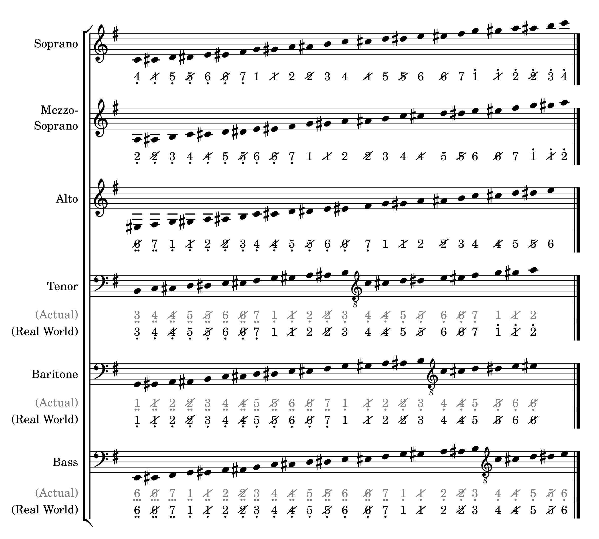
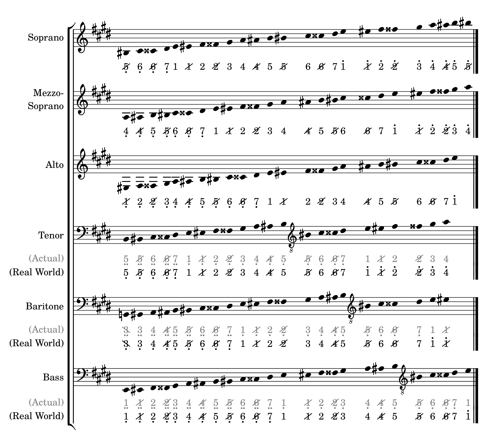
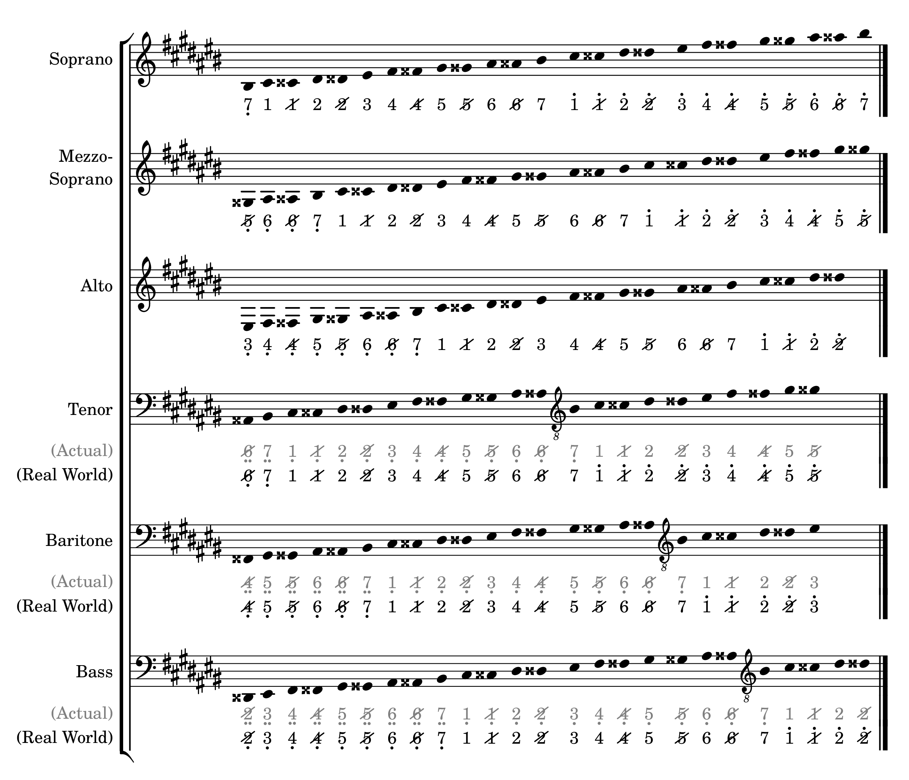
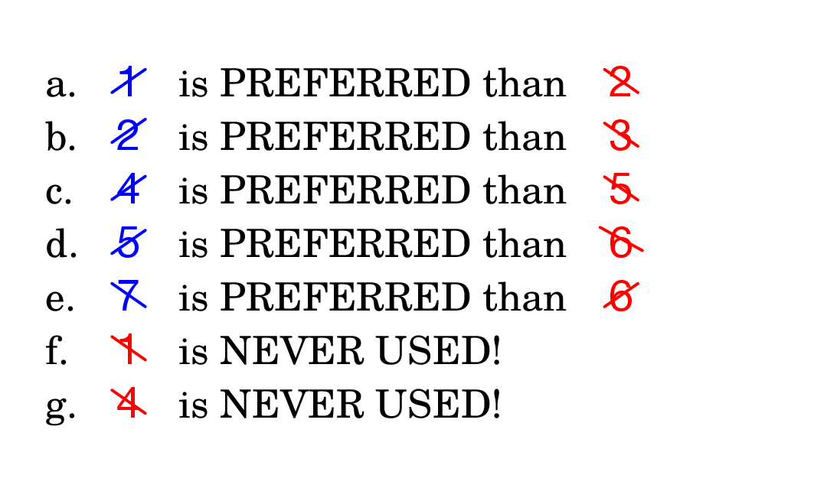

People say: _"A picture is worth a thousand words"_. Let's bring up some pictures here to better show the differences (and implicitly, the equivalencies) between both notation systems. 
  Just take a seat, and relax!
{: .fs-6 }

Let's take a reference from what Wikipedia says: [Vocal range](https://en.wikipedia.org/wiki/Vocal_range). Please take a note that the ranges given below **are approximations** and **are not meant to be too rigidly applied**. 
{: .fs-5 }
There are 2 solmisasi sub-staves below the standard male vocal staves: _(Actual)_ and _(Real World)_. The pitch numbers on (Actual) are the 'actual' pitch numbers converted from the standard notation pitches, while the ones on (Real World) are the 'real-world' pitch numbers that the solmisasi system applied in vocal music. Using the same Lilypond music passages/sequences, it can be achieved by setting a custom staff context property named `male-vocal` to `##t` (true).
{: .fs-4 }

1. TOC
{:toc .fs-5 }

---

## Pitches in C Major
{: .text-delta .fs-6 }

### Sharp Mode
{: no_toc }

Click to show/hide

### Flat Mode
{: no_toc }

Click to show/hide

---

## Pitches in Sharp Key Signatures
{: .text-delta .fs-6 }

All pitches shown below are written in **'sharp mode'**.
{: .fs-5 }

- ### G Major or E Minor (One Sharp)

  

  
Click to show/hide

  
  

- ### D Major of B Minor (Two Sharps)

  

  
Click to show/hide

  
  

- ### A Major or F♯ Minor (Three Sharps)

  In this key signature, there are 2 modes in writing notes in solmisasi system as described below.
  {: .fs-5 }

  #### Mode 1: Actual
  {: no_toc }

  The actual conversion from standard to solmisasi system is shown below.
  {: .fs-5 }
  

  
Click to show/hide

  
  

  #### Mode 2: Common Alternative
  {: no_toc }

  However, it is a common practice that the music author define the `A3` pitch (first `A` below middle `C`, or `a` in default Lilypond pitch name syntax) as the natural `1` (`do`). This can be achieved by transposing the converted-to-solmisasi music up by one octave. So, this 'adjusted' conversion is shown below.
  {: .fs-5 }
  

  
Click to show/hide

  
  

- ### E Major or C♯ Minor (Four Sharps)

  

  
Click to show/hide

  
  

- ### B Major or G♯ Minor (Five Sharps)

  

  
Click to show/hide

  
  

- ### F♯ Major or D♯ Minor (Six Sharps)

  

  
Click to show/hide

  
  

- ### C♯ Major or A♯ Minor (Seven Sharps)

  

  
Click to show/hide

  
  

---

## Pitches in Flat Key Signatures
{: .text-delta .fs-6 }

All pitches shown below are written in **'flat mode'**.
{: .fs-5 }

- ### F Major or D Minor (One Flat)

  

  
Click to show/hide

  
  

- ### B♭ Major (Two Flats)

  In this key signature, there are 2 modes in writing notes in solmisasi system as described below.
  {: .fs-5 }

  #### Mode 1: Actual
  {: no_toc }

  The actual conversion from standard to solmisasi system is shown below.
  {: .fs-5 }
  

  
Click to show/hide

  
  

  #### Mode 2: Common Alternative
  {: no_toc }

  Similar to the case of [A Major or F# Minor key](#a-major-or-f-minor-three-sharps), it is a common practice that the music author define the `B♭3` pitch (first `B♭` below middle `C`, or `bes` in default Lilypond pitch name syntax) as the natural `1` (`do`). This can be achieved by transposing the converted-to-solmisasi music up by one octave. So, this 'adjusted' conversion is shown below.
  {: .fs-5 }
  

  
Click to show/hide

  
  

- ### E♭ Major (Three Flats)

  

  
Click to show/hide

  
  

- ### A♭ Major (Four Flats)

  In this key signature, there are 2 modes in writing notes in solmisasi system as described below.
  {: .fs-5 }

  #### Mode 1: Actual
  {: no_toc }

  The actual conversion from standard to solmisasi system is shown below.
  {: .fs-5 }
  

  
Click to show/hide

  
  

  #### Mode 2: Common Alternative
  {: no_toc }

  Similar to the case of [A Major or F# Minor key](#a-major-or-f-minor-three-sharps), it is a common practice that the music author define the `A♭3` pitch (first `A♭` below middle `C`, or `aes` in default Lilypond pitch name syntax) as the natural `1` (`do`). This can be achieved by transposing the converted-to-solmisasi music up by one octave. So, this 'adjusted' conversion is shown below.
  {: .fs-5 }
  

  
Click to show/hide

  
  

- ### D♭ Major (Five Flats)

  

  
Click to show/hide

  
  

- ### G♭ Major (Six Flats)

  

  
Click to show/hide

  
  

- ### C♭ Major (Seven Flats)

  

  
Click to show/hide

  
  

---

## Preferred Pitch Numbers
{: .text-delta .fs-6 }

In most cases of writing score/sheet music in _solmisasi_ system and based on common practice, especially in Indonesia, regardless of the key signatures being used, there are some pitch numbers which users (singers, vocal groups, or choirs) doesn't like. Therefore, many music authors tend to avoid using these pitch numbers. 
The preferred solmisasi pitch numbers are listed below.
{: .fs-5 }

The question is: _How do we choose the pitches to be used, if the 'original' converted pitches are not the preferred ones?_
{: .fs-5 }

The answer would be totally based on the skill, style, and technique that the author have and use in creating Lilypond scores. Someone could just replace the avoided pitches with the preferred ones. However, if I intend to have both outputs (standard and solmisasi), I would prefer using 'tags' in my Lilypond snippets to distinguish those notes using their enharmonic equivalencies.
{: .fs-5 }

So, what are you waiting for? Let's [get started!](../getting-started/)
{: .fs-7 }
