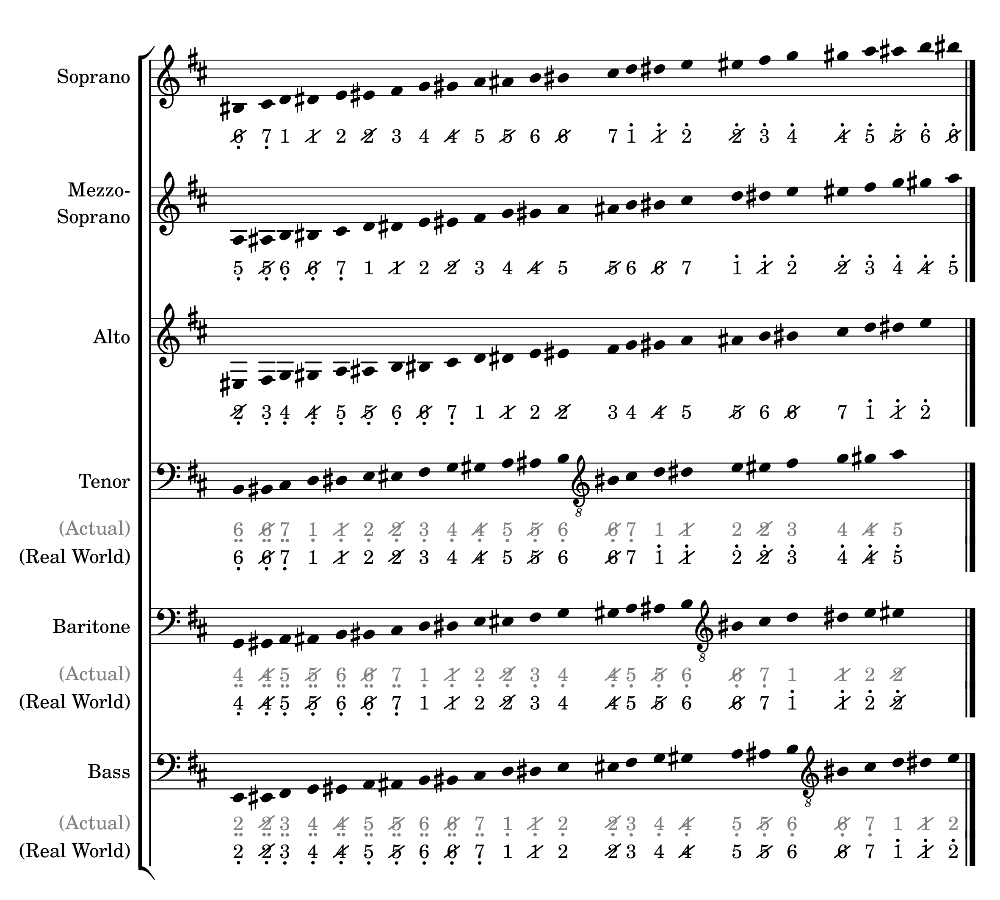
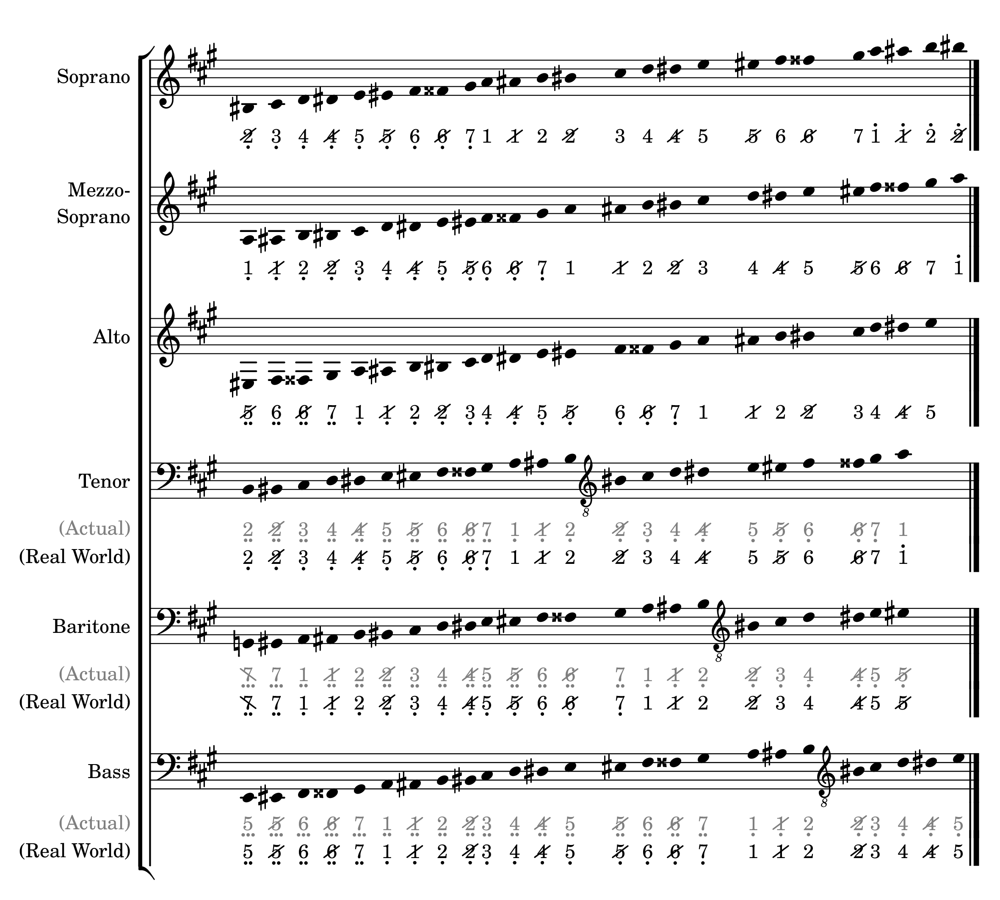
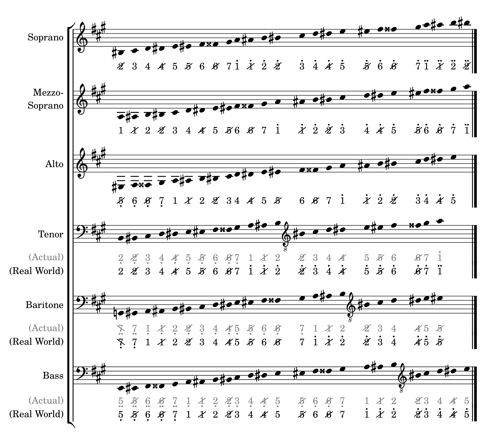

People say: _"A picture is worth a thousand words"_. Let's bring up some pictures here to better show the differences (and implicitly, the equivalencies) between both notation systems. 
  Just take a seat, and relax!
{: .fs-6 }

Let's take a reference from what Wikipedia says: [Vocal range](https://en.wikipedia.org/wiki/Vocal_range). Please take a note that the ranges given below **are approximations** and **are not meant to be too rigidly applied**. 
{: .fs-5 }
There are 2 solmisasi sub-staves below the standard male vocal staves: _(Actual)_ and _(Real World)_. The pitch numbers on (Actual) are the 'actual' pitch numbers converted from the standard notation pitches, while the ones on (Real World) are the 'real-world' pitch numbers that the solmisasi system applied in vocal music. Using the same Lilypond music passages/sequences, it can be achieved by setting a custom staff context property named `male-vocal` to `##t` (true).
{: .fs-4 }

1. TOC
{:toc .fs-5 }

---

## Pitches in C Major
{: .text-delta .fs-6 }

### Sharp Mode
{: no_toc }

Click to show/hide

### Flat Mode
{: no_toc }

Click to show/hide

---

## Pitches in Sharp Key Signatures
{: .text-delta .fs-6 }

- ### G Major (One Sharp)

  #### Mode 1: Actual
  {: no_toc }

  The actual conversion from standard to solmisasi system is shown below.
  

  
Click to show/hide

  
  

  #### Mode 1: Common Alternative
  {: no_toc }

  However, it is a common practice that the music author define the `G3` pitch (first `G` below middle `C`, or `g` in Lilypond syntax) as the natural `1` (`do`). This can be achieved by transposing the music up by one octave in conversion process. So, this 'adjusted' alternative conversion is shown below.
  

  
Click to show/hide

  
  

- ### D Major (Two Sharps)

  

  
Click to show/hide

  
  

- ### A Major (Three Sharps)

  #### Mode 1: Actual
  {: no_toc }

  The actual conversion from standard to solmisasi system is shown below.
  

  
Click to show/hide

  
  

  #### Mode 1: Common Alternative
  {: no_toc }

  Similar to the case of [G major key](#g-major-one-sharp), it is a common practice that the music author define the `A3` pitch (first `A` below middle `C`, or `a` in Lilypond syntax) as the natural `1` (`do`). This can be achieved by transposing the music up by one octave in conversion process. So, this 'adjusted' conversion is shown below.
  

  
Click to show/hide

  
  

- ### E Major (Four Sharps)

  

  
Click to show/hide

  
  

- ### B Major (Five Sharps)

  

  
Click to show/hide

  
  

- ### F♯ Major (Six Sharps)

  

  
Click to show/hide

  
  

- ### C♯ Major (Seven Sharps)

  

  
Click to show/hide

  
  

---

## Pitches in Flat Key Signatures
{: .text-delta .fs-6 }

- ### F Major (One Flat)
- ### B♭ Major (Two Flats)
- ### E♭ Major (Three Flats)
- ### A♭ Major (Four Flats)
- ### D♭ Major (Five Flats)
- ### G♭ Major (Six Flats)
- ### C♭ Major (Seven Flats)
